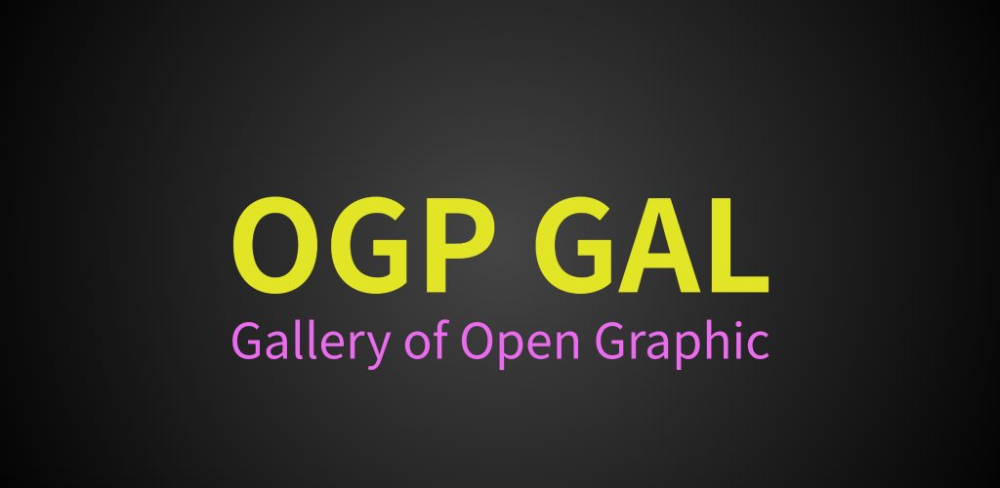

 

<h1 align="center">OGP Gallery</h1>

## コンセプト
開発者の方が利用できるOGP資料集を目指しています。  
[参考資料: バイラル係数を左右するOGPとマイクロブラウザ](https://gigazine.net/news/20191219-microbrowsers-are-everywhere/)

## 進捗
1. プロトタイプのリリース  
    - [Web版(開発1日目の公開時点)](https://youtu.be/-VZmPOavE8M)   
    - [アプリ版(同上)](https://youtu.be/NcmQW6U2gVA) 
1. ユーザにフィードバックを貰う( ← 現在ここ)
1. バグの修正や機能追加

## 公開中のWebサイト/Android/iOSアプリ
- [Web版](https://ogp-gal.com/)
- [Androidベータ版](https://play.google.com/store/apps/details?id=ogp.gal)
- [iOSベータ版](https://testflight.apple.com/join/nGV3D8ab)

## ソースコード
- [フロントエンド部分(E2Eテストも含む)](https://github.com/go-u/ogp-front)
- [バックエンド部分(Docker等も含む)](https://github.com/go-u/ogp-back)  
**CI/CD**や**ユニットテスト**などのコードも各リポジトリにあります。

## 機能一覧
- Eメール/パスワードログイン
- ソーシャルログイン
- 投稿機能
- ブックマーク機能
- ユーザ画像の更新機能
- [投稿者権限の判定](https://github.com/go-u/ogp-back/blob/master/server/db/schema/user/user.sql)(今は全ユーザ許可)  
などです（プロトタイプ版のため機能は少なめです）  
