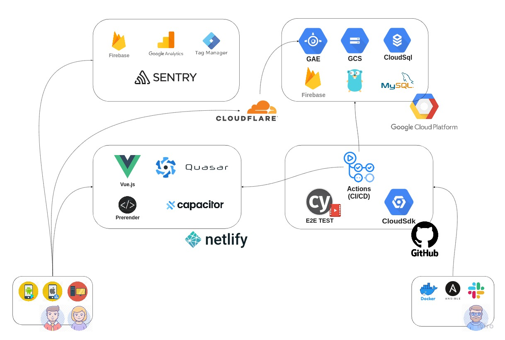

 

<h1 align="center">OGP Gallery システム構成</h1>

<h1 align="center">OGP Crawler システム構成</h1>

## コンセプト
開発者の方が利用できるシェア画像(OGP)資料集です。  
[参考: マイクロブラウザとシェア画像](https://gigazine.net/news/20191219-microbrowsers-are-everywhere/)

## 公開中のWebサイト/Android/iOSアプリ
- [Web版](https://ogp-gal.com/)
- [Androidベータ版](https://play.google.com/store/apps/details?id=ogp.gal)
- [iOSベータ版](https://testflight.apple.com/join/nGV3D8ab)

## ソースコード
- [フロントエンド部分(E2Eテスト含む)](https://github.com/go-u/ogp-front)
- [バックエンド部分(Docker含む)](https://github.com/go-u/ogp-back)
- [クローラー部分](https://github.com/go-u/ogp-crawler)    
テストやCI/CD等のコードも各リポジトリにあります。

